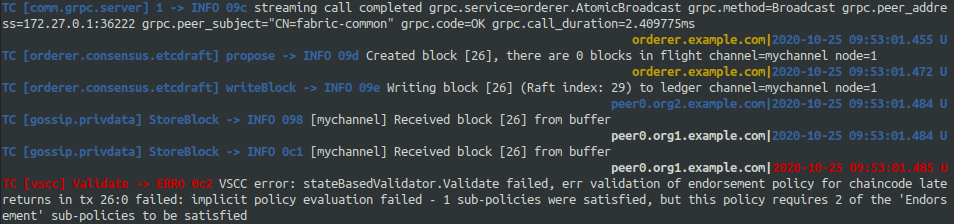

# MSc in Computing - Developing Smart Contract Applications for the HyperLedger Fabric Platform

## Developing a Smart Contract

### The Use Case
This paper examines a Library use-case and the lender/borrower relationship. We provide an in-depth analysis of a development of a smart contract and client application running on the HyperLedger platform. 

### Setting Up a Development Environment

The following are required:

```
Git client
Go version 1.14.x
Docker version 18.03 or later
SoftHSM
jq
```

### Accord Project Contracts

Using VS Code...


### The Contract Text

// TODO: the Cicero language and cli

```
## Dublin CoCo Libraries - Late Returns.

In case of a overdue return of an item, {{borrower}} (the Borrower) shall 
pay to {{lender}} (the Lender) a fine amounting to {{fineAmount}} (EUR)
for every {{fineDuration}} the item was returned overdue. Any fractional part
of a {{fractionalPart}} is to be considered a full {{fractionalPart}}. The total amount of fine 
shall not however, exceed {{capPercentage}}% of the total value of the borrowed item.

{{#if exceptionCase}}The contract provides a provision to waive late penalties in the event
of extenuating circumstances. This is wholely at the discretion of the
Lender and all decisions are final in this matter.{{/if}}
```

### Contract Testing - Parsing 


### Contract Testing - Triggering Transaction


### Using Mocha for Unit Tests
// TODO:

### Errors

Any formatting of the contract text requires careful attention to corresponding requests and tests.


The following error prevented test cases passing successfully.


### Debugging Contract Issues

From a development perspective, being able to develop locally with minimal dependencies is desireable. Since we cannot attach a debugger directly to chaincode running on-chain, we need to be able to test without a HyperLedger Fabric network involved.

Thankfully, we can use our Mocha tests and attach the debugger as normal.


## HyperLedger Fabric

### Setting up the Fabric Network
Using the HyperLedger Fabric sample "test-network", we create a two org network with a single peer in each org.


```
➜  msc-smartcontract-hyperledger git:(master) ✗ docker ps  
CONTAINER ID        IMAGE                               COMMAND                  CREATED             STATUS              PORTS                              NAMES
8635d83c82d8        hyperledger/fabric-orderer:latest   "orderer"                30 seconds ago      Up 29 seconds       0.0.0.0:7050->7050/tcp             orderer.libraries.dublincoco.org
069c2f211bcc        hyperledger/fabric-peer:latest      "peer node start"        30 seconds ago      Up 29 seconds       0.0.0.0:7051->7051/tcp             peer0.org1.libraries.dublincoco.org
076d5fe2f763        hyperledger/fabric-peer:latest      "peer node start"        30 seconds ago      Up 29 seconds       7051/tcp, 0.0.0.0:9051->9051/tcp   peer0.org2.libraries.dublincoco.org
a7c1de0a1a2a        hyperledger/fabric-ca:latest        "sh -c 'fabric-ca-se…"   36 seconds ago      Up 35 seconds       7054/tcp, 0.0.0.0:9054->9054/tcp   ca_orderer
9ab1b7d19355        hyperledger/fabric-ca:latest        "sh -c 'fabric-ca-se…"   36 seconds ago      Up 35 seconds       0.0.0.0:7054->7054/tcp             ca_org1
2cb592d53c8c        hyperledger/fabric-ca:latest        "sh -c 'fabric-ca-se…"   36 seconds ago      Up 35 seconds       7054/tcp, 0.0.0.0:8054->8054/tcp   ca_org2
```

By stopping one of the chain-code containers, what happens when submitting another transaction?
`docker stop dev-peer0.org1.libraries.dublincoco.org-latereturns_1.0.0-ae83f25e52b526eda8126766069f34bd1a3f7a2d79e3c7f5b5aa8ad6eba4ea53`

We try to trigger a transaction and we receive a consensus error:

```
2020-10-25T09:42:58.932Z - warn: [TransactionEventHandler]: strategyFail: commit failure for transaction "70944848533e78d554f0f7ec1358913ba70c74a77874a7a25e3145d89346c719": TransactionError: Commit of transaction 70944848533e78d554f0f7ec1358913ba70c74a77874a7a25e3145d89346c719 failed on peer peer0.org1.libraries.dublincoco.org:7051 with status ENDORSEMENT_POLICY_FAILURE
******** FAILED to run the application: TransactionError: Commit of transaction 70944848533e78d554f0f7ec1358913ba70c74a77874a7a25e3145d89346c719 failed on peer peer0.org1.libraries.dublincoco.org:7051 with status ENDORSEMENT_POLICY_FAILURE
```


Container orchestration layer such as Kubernetes would attempt to guarantee desired state so this would be beneficial to ensure consistency at the container level and thus ensure consensus.

### Debugging
// TODO: how to debug smart contracts locally since they cannot be debugged after installed on chain?

### Testing


## Developing a HyperLedger Client Application

Real-world smart contracts will likely contain functions using complex types or verbose data that is passed via arguments. This makes testing with the Fabric cli difficult e.g. passing contract verbiage or json payloads. A more realistic and manageable approach would be to develop a client application using a supported language and leverage common libraries and utilities that are available.

Using the tutorial sample applications, we develop a client application that interacts with the ledger and smart contract chain-code for the described use-case. We will use Javascript initially and compare the development of other chain-code languages if time permits.

https://hyperledger-fabric.readthedocs.io/en/latest/write_first_app.html

The samples provide utilities to create and register users and wallets.

### Errors

User identities from previous tests cannot be reused and must be deleted. The client app will then recreate and register the users.

```
Failed to register user : Error: fabric-ca request register failed with errors [[ { code: 0,
    message:
     'Registration of \'appUser\' failed: Identity \'appUser\' is already registered' } ]]
******** FAILED to run the application: Error: Identity not found in wallet: appUser
```
*Upgrade issues*
`WARNING Local fabric-ca binaries and docker images are out of sync. This may cause problems.`

### CICD

1. Use CLI container
2. Use docker client to run HLF commands on specific containers. For example:

`docker exec peer0.org1.libraries.dublincoco.org peer chaincode query -C mychannel -n latereturns -c '{"function":"queryState","Args":["CTR_100002"]}'`


## Distributed Ledger on PaaS
// TODO:


## References
https://dl.acm.org/doi/pdf/10.1109/WETSEB.2019.00013?download=true
https://iopscience.iop.org/article/10.1088/1742-6596/1187/5/052005/pdf